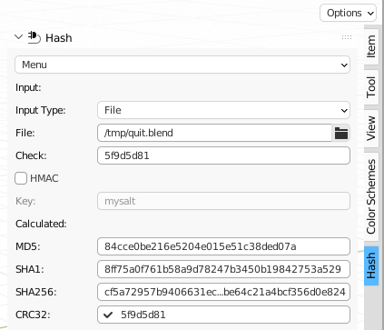

# blender-utilities
My Utilities for Blender

## Color Scheme addon for Blender
The color scheme addon is based on [Agave 0.4.7](https://web.archive.org/web/20170327063642/http://home.gna.org/colorscheme/).

## Hash addon for Blender
The hash addon is my recreation of [GTKHash](https://github.com/tristanheaven/gtkhash). However the source code is not based on GTKHash.

