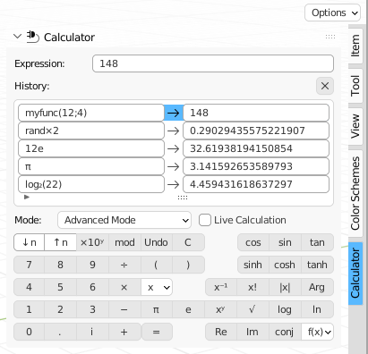
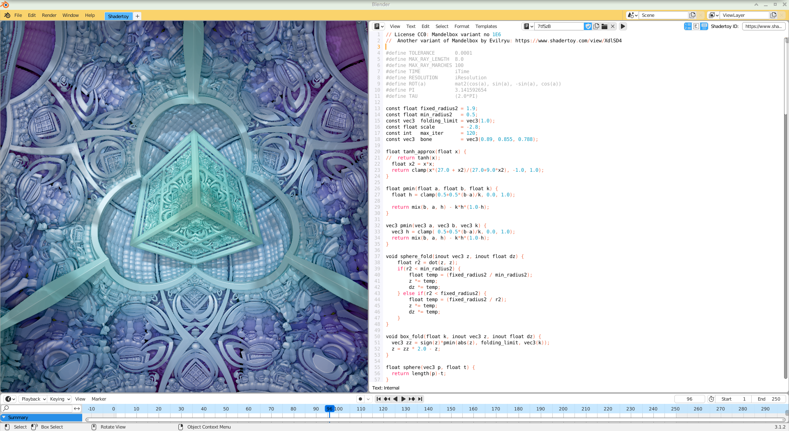

# blender-utilities
My Utilities for Blender

## Color Scheme addon for Blender
The color scheme addon is based on [Agave 0.4.7](https://web.archive.org/web/20170327063642/http://home.gna.org/colorscheme/).

## Hash addon for Blender
The hash addon is my recreation of [GtkHash 1.2](https://github.com/tristanheaven/gtkhash). The source code is *not* based on GtkHash, though.

## Calculator addon for Blender
The calculator addon is my recreation of [Gnome Calculator](https://wiki.gnome.org/Apps/Calculator) but less functional. It just needs more love. The source code is *not* based on Gnome Calculator.

## Shadertoy Viewer addon for Blender
The shadertoy viewer addon is currently just a [Shadertoy](https://www.shadertoy.com/) viewer in Blender. The viewer supports basic Shadertoy shaders.

The addon will not become the alternative of [Synthclipse](http://synthclipse.sourceforge.net/) because of Blender API limitations but more advanced features would be possible.

